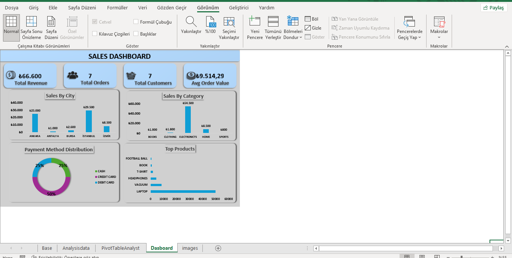
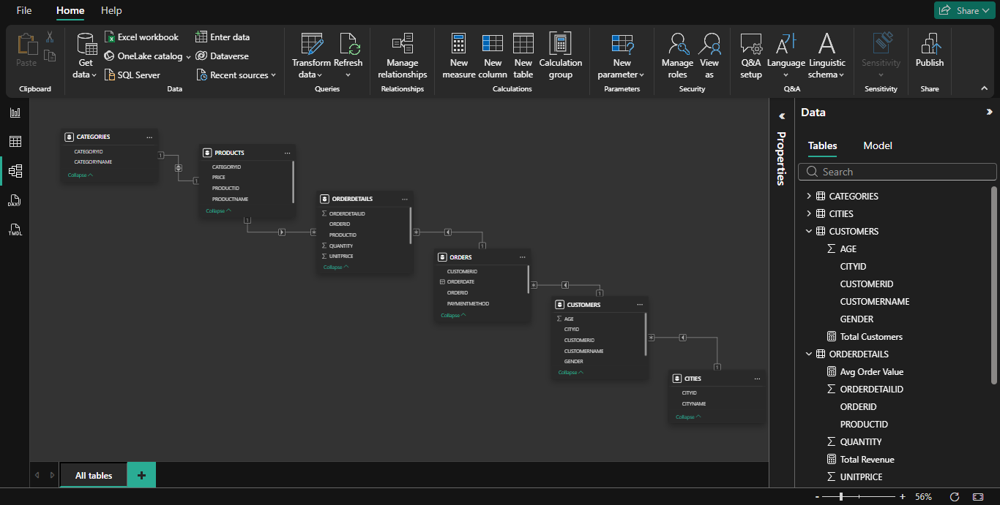

# 📊 Sales Analysis Project (Excel + SQL + Power BI)

This project is an end-to-end sales analysis built using **SQL, Excel, and Power BI**.

---

## 🚀 Project Overview

In this project, I:

* created a relational database
* generated and inserted sales data
* performed SQL-based data analysis
* built an Excel dashboard for visualization
* developed a Power BI dashboard for advanced reporting

---

## 📁 Project Structure

```text
sales-analysis-excel-sql-powerbi/
│
├── excel/
│   ├── ecommerce_dashboard.xlsx
│   └── screenshots/
│       ├── AnalysisData.png
│       ├── Base.png
│       ├── Images.png
│       ├── PivotTableAnalyst.png
│       └── excel-dashboard.png
│
├── sql/
│   ├── SalesAnalysisDB_Setup.sql
│   ├── analysis_queries.sql
│   └── analysis_queries_video.mp4
│
├── powerbi/
│   ├── sales_dashboard.pbix
│   └── screenshots/
│       ├── powerbi-dashboard.png
│       └── relation-table.png
│
└── README.md
```

---

## 📊 Excel Dashboard

Main file:

```text
excel/ecommerce_dashboard.xlsx
```

Dashboard preview:



---

## 📈 SQL Analysis

SQL files:

```text
sql/SalesAnalysisDB_Setup.sql
sql/analysis_queries.sql
```

Query explanations video:

```text
sql/analysis_queries_video.mp4
```

The analysis includes:

* total sales
* average order value
* product performance
* customer analysis
* monthly trends
* payment method analysis

---

## 📊 Power BI Dashboard

Power BI file:

```text
powerbi/sales_dashboard.pbix
```

Dashboard preview:


Data model:



The dashboard includes:

* Top 10 Cities by Revenue
* Top 10 Categories by Revenue
* Top 10 Products by Revenue
* Payment Method Distribution
* KPI metrics (Total Revenue, Orders, Customers, Avg Order Value)

---

## 🎯 Purpose

This project focuses on improving:

* SQL querying skills
* data analysis thinking
* dashboard development
* business intelligence skills

---

## 👨‍💻 About Me

Junior Data Analyst focused on Excel, SQL, and Power BI.

📎 LinkedIn:
https://www.linkedin.com/in/emre-erol-642bb5293/
